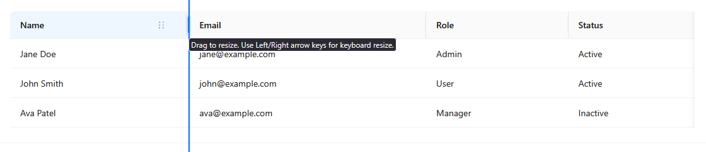
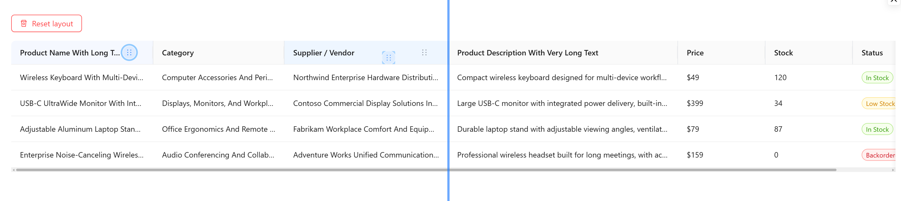

<div align="center">

# antd-table-enhanced

A drop-in enhanced Ant Design Table with resizable, reorderable, and remembered columns.

[Live Demo](https://abhijeet-oxide.github.io/antd-table-enhanced/) ·
[Examples](https://abhijeet-oxide.github.io/antd-table-enhanced/) ·
[npm](https://www.npmjs.com/package/antd-table-enhanced) ·
[GitHub](https://github.com/abhijeet-oxide/antd-table-enhanced)

</div>

<div align="center">

[](https://github.com/abhijeet-oxide/antd-table-enhanced/actions/workflows/publish.yml)
[](https://github.com/abhijeet-oxide/antd-table-enhanced/actions/workflows/pages.yml)
[](https://www.npmjs.com/package/antd-table-enhanced)
[](https://www.npmjs.com/package/antd-table-enhanced)
[](./LICENSE)
[](https://ant.design/)

</div>

---

## Demo

Try the package in your browser:

**[Live Demo](https://abhijeet-oxide.github.io/antd-table-enhanced/)**

Explore usage examples:

**[Examples](https://abhijeet-oxide.github.io/antd-table-enhanced/)**

## Sample

<div align="center">
  <figure>
    
    <figcaption>
      <strong>Resizable Columns</strong><br />
      Drag column edges to resize table columns and preserve the adjusted layout.
    </figcaption>
  </figure>
</div>

<br />

<div align="center">
  <figure>
    
    <figcaption>
      <strong>Reorderable Columns</strong><br />
      Drag column headers to reorder columns and keep the customized layout.
    </figcaption>
  </figure>
</div>

---

## Overview

`antd-table-enhanced` extends Ant Design's `Table` with practical column interaction features commonly needed in modern data-heavy applications.

It adds:

- Resizable columns
- Reorderable columns
- Persisted column width and order
- Resettable table layout
- Per-column resize/reorder controls
- Compatibility with the Ant Design `Table` API

It is designed to work as a drop-in replacement for Ant Design's table component.

```tsx
import { Table } from "antd-table-enhanced";
```

---

## Features

| Feature               | Description                                                |
| --------------------- | ---------------------------------------------------------- |
| Resizable columns     | Users can resize columns directly from the table header    |
| Reorderable columns   | Users can drag columns to change their order               |
| Remembered layout     | Column width and order can persist across page refreshes   |
| Reset layout          | Expose a reset action to restore the default column layout |
| AntD compatible       | Continue using standard Ant Design `Table` props           |
| Per-column control    | Disable resizing or reordering for individual columns      |
| No extra style import | No separate package stylesheet import required             |

---

## Installation

Using pnpm:

```bash
pnpm add antd-table-enhanced
```

Using npm:

```bash
npm install antd-table-enhanced
```

Using yarn:

```bash
yarn add antd-table-enhanced
```

Required peer dependencies:

```bash
pnpm add react react-dom antd @ant-design/icons
```

---

## Quick Start

Replace this:

```tsx
import { Table } from "antd";
```

With this:

```tsx
import { Table } from "antd-table-enhanced";
```

Then use it like a standard Ant Design table.

```tsx
import { Table } from "antd-table-enhanced";

const columns = [
  {
    title: "Name",
    dataIndex: "name",
    key: "name",
    width: 200,
  },
  {
    title: "Email",
    dataIndex: "email",
    key: "email",
    width: 280,
  },
  {
    title: "Role",
    dataIndex: "role",
    key: "role",
    width: 160,
  },
];

const data = [
  {
    id: 1,
    name: "Jane Doe",
    email: "jane@example.com",
    role: "Admin",
  },
  {
    id: 2,
    name: "John Smith",
    email: "john@example.com",
    role: "User",
  },
];

export default function UsersTable() {
  return (
    <Table
      tableEnhancedKey="users-table"
      rowKey="id"
      columns={columns}
      dataSource={data}
    />
  );
}
```

---

## Basic Example

```tsx
import { Table } from "antd-table-enhanced";

const columns = [
  {
    title: "Name",
    dataIndex: "name",
    key: "name",
    width: 220,
  },
  {
    title: "Email",
    dataIndex: "email",
    key: "email",
    width: 300,
  },
  {
    title: "Status",
    dataIndex: "status",
    key: "status",
    width: 160,
  },
];

const data = [
  {
    id: 1,
    name: "Jane Doe",
    email: "jane@example.com",
    status: "Active",
  },
  {
    id: 2,
    name: "John Smith",
    email: "john@example.com",
    status: "Inactive",
  },
];

export default function Example() {
  return (
    <Table
      tableEnhancedKey="basic-users-table"
      rowKey="id"
      columns={columns}
      dataSource={data}
      pagination={false}
    />
  );
}
```

---

## Column Keys

For best results, every column should have a stable `key`.

```tsx
const columns = [
  {
    title: "Name",
    dataIndex: "name",
    key: "name",
  },
  {
    title: "Email",
    dataIndex: "email",
    key: "email",
  },
];
```

The column `key` is used to identify columns when saving and restoring layout state.

---

## Table Layout Persistence

Use `tableEnhancedKey` to uniquely identify each enhanced table.

```tsx
<Table tableEnhancedKey="users-table" columns={columns} dataSource={data} />
```

If your application has multiple tables, use a different key for each table.

```tsx
<Table tableEnhancedKey="users-table" />
<Table tableEnhancedKey="orders-table" />
<Table tableEnhancedKey="products-table" />
```

This prevents layout preferences from one table affecting another.

---

## Reset Layout

Use `tableEnhancedActionsRef` to access enhanced table actions such as resetting the saved column layout.

```tsx
import { useRef } from "react";
import { Button, Space } from "antd";
import { Table } from "antd-table-enhanced";
import type { TableEnhancedActions } from "antd-table-enhanced";

const columns = [
  {
    title: "Name",
    dataIndex: "name",
    key: "name",
    width: 220,
  },
  {
    title: "Email",
    dataIndex: "email",
    key: "email",
    width: 300,
  },
  {
    title: "Role",
    dataIndex: "role",
    key: "role",
    width: 180,
  },
];

const data = [
  {
    id: 1,
    name: "Jane Doe",
    email: "jane@example.com",
    role: "Admin",
  },
  {
    id: 2,
    name: "John Smith",
    email: "john@example.com",
    role: "User",
  },
];

export default function UsersTable() {
  const actionsRef = useRef<TableEnhancedActions | null>(null);

  return (
    <Space direction="vertical" size="middle" style={{ width: "100%" }}>
      <Button onClick={() => actionsRef.current?.resetLayout()}>
        Reset layout
      </Button>

      <Table
        tableEnhancedKey="users-table"
        tableEnhancedActionsRef={actionsRef}
        rowKey="id"
        columns={columns}
        dataSource={data}
      />
    </Space>
  );
}
```

---

## Disable Column Resizing

Disable resizing for the entire table:

```tsx
<Table
  tableEnhancedKey="users-table"
  enableColumnResize={false}
  columns={columns}
  dataSource={data}
/>
```

Disable resizing for a specific column:

```tsx
const columns = [
  {
    title: "Actions",
    key: "actions",
    disableResize: true,
    render: () => <button>View</button>,
  },
];
```

---

## Disable Column Reordering

Disable reordering for the entire table:

```tsx
<Table
  tableEnhancedKey="users-table"
  enableColumnReorder={false}
  columns={columns}
  dataSource={data}
/>
```

Disable reordering for a specific column:

```tsx
const columns = [
  {
    title: "Actions",
    key: "actions",
    disableReorder: true,
    render: () => <button>View</button>,
  },
];
```

---

## Disable Resize and Reorder for a Column

This is useful for action columns or columns that should remain fixed in behavior.

```tsx
const columns = [
  {
    title: "Actions",
    key: "actions",
    width: 120,
    disableResize: true,
    disableReorder: true,
    render: () => <button>View</button>,
  },
];
```

---

## API

`antd-table-enhanced` supports standard Ant Design `Table` props and adds the following enhanced props.

| Prop                      | Type                                      | Default         | Description                                  |
| ------------------------- | ----------------------------------------- | --------------- | -------------------------------------------- |
| `tableEnhancedKey`        | `string`                                  | `undefined`     | Unique key used to persist table layout      |
| `enableColumnResize`      | `boolean`                                 | `true`          | Enables or disables column resizing          |
| `enableColumnReorder`     | `boolean`                                 | `true`          | Enables or disables column reordering        |
| `tableEnhancedActionsRef` | `RefObject<TableEnhancedActions \| null>` | `undefined`     | Ref for accessing enhanced table actions     |
| `minColumnWidth`          | `number`                                  | Package default | Minimum width allowed while resizing         |
| `defaultColumnWidth`      | `number`                                  | Package default | Width used when a column does not define one |
| `showColumnControls`      | `"hover" \| "always" \| "never"`          | Package default | Controls visibility of column interaction UI |

---

## Column Options

In addition to standard Ant Design column configuration, columns can use the following options.

| Option           | Type      | Description                             |
| ---------------- | --------- | --------------------------------------- |
| `disableResize`  | `boolean` | Disables resizing for the column        |
| `disableReorder` | `boolean` | Disables drag reordering for the column |

Example:

```tsx
const columns = [
  {
    title: "Actions",
    key: "actions",
    width: 120,
    disableResize: true,
    disableReorder: true,
    render: () => <button>View</button>,
  },
];
```

---

## TypeScript

The package includes TypeScript support.

```tsx
import type { TableEnhancedActions } from "antd-table-enhanced";
```

Example:

```tsx
import { useRef } from "react";
import type { TableEnhancedActions } from "antd-table-enhanced";

const actionsRef = useRef<TableEnhancedActions | null>(null);
```

---

## Migration from Ant Design Table

Most existing Ant Design tables can be migrated by changing the import.

Before:

```tsx
import { Table } from "antd";
```

After:

```tsx
import { Table } from "antd-table-enhanced";
```

Recommended additions:

```tsx
<Table
  tableEnhancedKey="users-table"
  rowKey="id"
  columns={columns}
  dataSource={data}
/>
```

For reliable persistence:

1. Add a unique `tableEnhancedKey`
2. Add stable `key` values to columns
3. Define column widths where appropriate
4. Disable resize/reorder for action columns if needed
5. Provide a reset layout option for complex tables

---

## Recommended Usage

For the best user experience:

- Use a unique `tableEnhancedKey` per table
- Add stable `key` values to all columns
- Add `width` values to important columns
- Disable resize/reorder for action columns
- Provide a reset layout button for tables with many columns

Example:

```tsx
<Table
  tableEnhancedKey="orders-table"
  rowKey="id"
  columns={columns}
  dataSource={data}
  pagination={{
    pageSize: 10,
  }}
/>
```

---

## Examples

The live demo includes practical examples for common usage patterns:

- Basic enhanced table
- Reset layout
- Disable resize and reorder
- Per-column controls

View examples here:

**[https://abhijeet-oxide.github.io/antd-table-enhanced/](https://abhijeet-oxide.github.io/antd-table-enhanced/)**

---

## Local Development

Install dependencies:

```bash
pnpm install
```

Build the package:

```bash
pnpm build
```

Run the demo locally:

```bash
pnpm demo:dev
```

Build the demo:

```bash
pnpm demo:build
```

Preview the production demo:

```bash
pnpm demo:preview
```

---

## GitHub Pages Deployment

The demo is deployed using GitHub Actions.

Workflow:

```txt
.github/workflows/pages.yml
```

Demo output:

```txt
examples/demo/dist
```

Live URL:

```txt
https://abhijeet-oxide.github.io/antd-table-enhanced/
```

To enable GitHub Pages:

1. Open the repository on GitHub
2. Go to **Settings**
3. Go to **Pages**
4. Set **Source** to **GitHub Actions**
5. Push to the `main` branch

---

## Compatibility

| Package    | Supported Version |
| ---------- | ----------------- |
| React      | 18+               |
| Ant Design | 5.x               |
| TypeScript | Supported         |

---

## Why Use This Package?

Ant Design provides a powerful table component, but many production applications require additional column interaction capabilities.

`antd-table-enhanced` provides those capabilities while keeping the Ant Design developer experience familiar.

Use it when you need:

- User-adjustable column widths
- User-controlled column order
- Persisted table layout preferences
- A simple migration path from Ant Design `Table`
- A reusable solution instead of rebuilding column resize/reorder behavior repeatedly

---

## License

MIT
